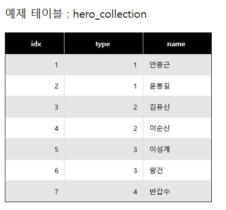
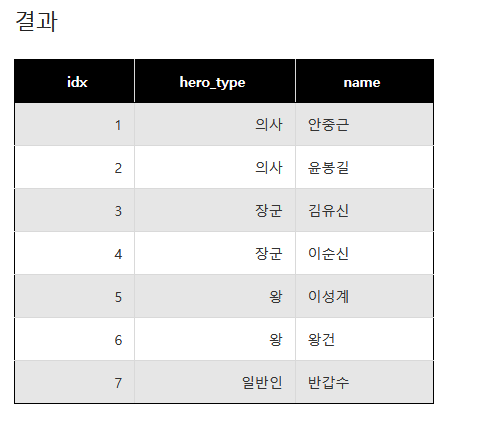

## CASE WHEN THEM

```
mysql에서 case문은 프로그래밍 언어에서 스위치(switch)문과 비슷하지만 다수의 조건에 하나의 반환값은 동작하지 않는다.
```

#### EXAMPLE
```sql
CASE
	WHEN 조건
	THEN '반환 값'
	WHEN 조건
	THEN '반환 값'
	ELSE 'WHEN 조건에 해당 안되는 경우 반환 값'
END
```

#### 예제


#### 쿼리
```sql
SELECT
	idx,
    CASE
		WHEN type = '1'
		THEN '의사'
		WHEN type = '2'
		THEN '장군'
		WHEN type = '3'
		THEN '왕'
		ELSE '일반인'
	END AS hero_type,
	name
FROM hero_collection;
```

#### 결과
