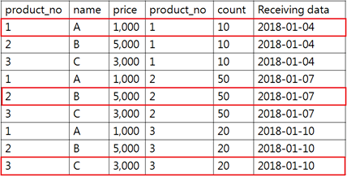
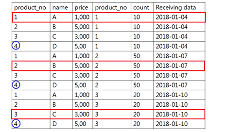

### Cross JOIN
두 테이블의 곱집합을 수행
```sql
SELECT * FROM table1, table2, ...
```

### Inner JOIN
WHERE 조건을 추가하여 조건에 맞는 데이터들만 조회하는 방식
product_no가 같은 데이터들만 조회하는 예제이다.
```sql
SELECT * FROM product, stock WHERE product.product_no = stock.product_no;
```



트랜디한 방법
- ON뒤에 결합 조건을 명시한다.
```sql
SELECT * FROM product INNER JOIN stock ON product.product_no = stock.product_no;
```

### External JOIN
어느 한쪽 테이블에만 존재하는 데이터들을 다른 테이블에 결합하는 방식

LEFT JOIN 예시
```sql
SELECT * FROM product LEFT JOIN stock ON product.product_no = stock.product_no;
```

```
INNER JOIN일 경우 빨간색으로 표시한 데이터만 조회되고, product_no가 4인 데이터는 결과에서 제외된다.
```

```
LEFT JOIN의 결과는 상품 테이블에서 product_no가 4인 데이터에 대해 재고 테이블이 존재하지 않으므로 NULL이 결합되어 조회된다.
```