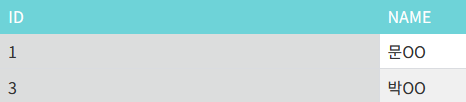

References
- https://mooonstar.tistory.com/entry/MYSQLMINUS%EC%B0%A8%EC%A7%91%ED%95%A9

## Oracle
#### 수강학생

#### 응시학생


#### 응시하지 않은 학생 조회
```sql
SELECT ID, NAME FROM STUDY
MINUS
SELECT ID, NAME FROM TEST;
```

## Mysql 구현
```sql
SELECT ID, NAME FROM study WHERE (ID, NAME) IN (SELECT ID, NAME FROM test);
```

#### 응시하지 않은 학생


#### join 방식
```sql
SELECT a.id, a.name
FROM study a
LEFT JOIN test b on a.id = b.id
WHERE b.id is NULL;
```

#### 응시하지 않은 학생
