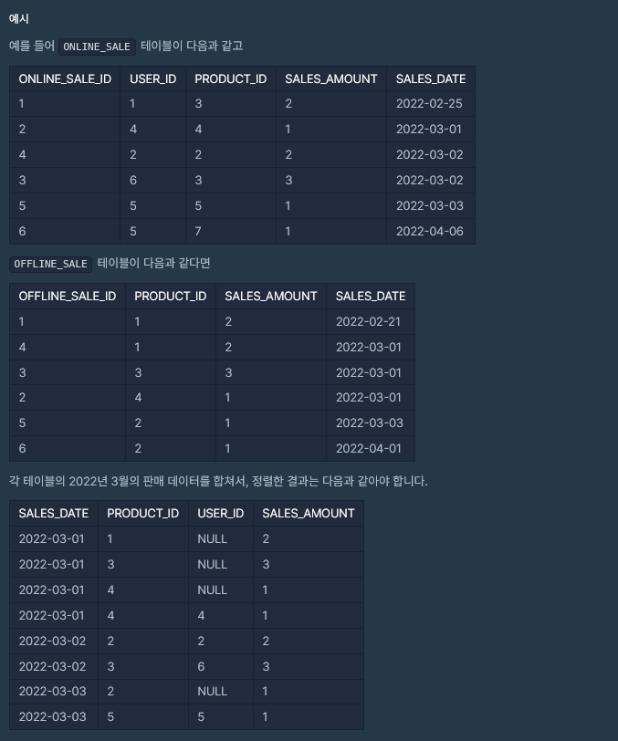
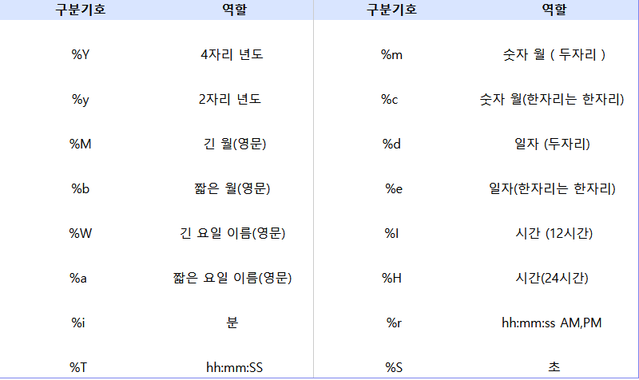

References
- https://school.programmers.co.kr/learn/courses/30/lessons/131537

### 프로그래머스( 오프라인/온라인 판매 데이터 통합하기 )


**답**
```sql
SELECT DATE_FORMAT(SALES_DATE,"%Y-%m-%d") SALES_DATE,
    PRODUCT_ID,
    USER_ID,
    SALES_AMOUNT
FROM ONLINE_SALE
WHERE sales_date like '2022-03%'

UNION ALL

SELECT DATE_FORMAT(SALES_DATE,"%Y-%m-%d") SALES_DATE,
    PRODUCT_ID,
    NULL AS USER_ID,
    SALES_AMOUNT
FROM OFFLINE_SALE 
WHERE sales_date like '2022-03%'
    
ORDER BY SALES_DATE , PRODUCT_ID , USER_ID
```

## 주요 SQL 용어

데이터 포멧 지정
```sql
DATE_FORMAT(SALES_DATE,"%Y-%m-%d") 
DATE_FORMAT(날짜 , 형식) : 날짜를 지정한 형식으로 출력
```


예시
```sql
SELECT DATE_FORMAT(NOW(),'%Y년%m월%d일 %H시%i분%S초') AS DATE FROM DUAL
```

result
```
2016년09월22일 17시00분05초
```
